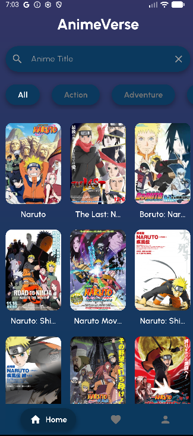
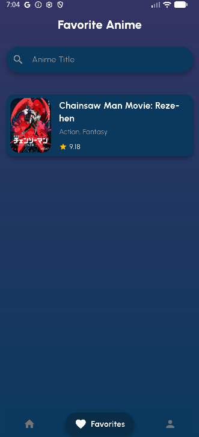
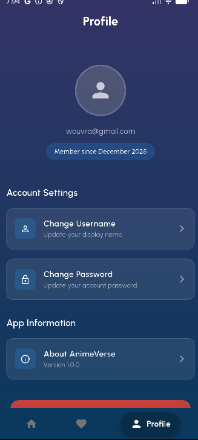
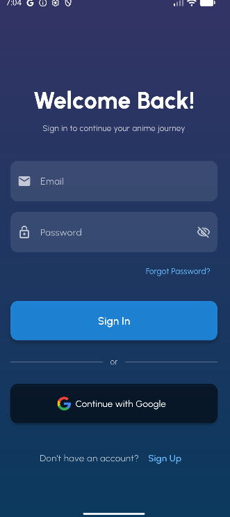
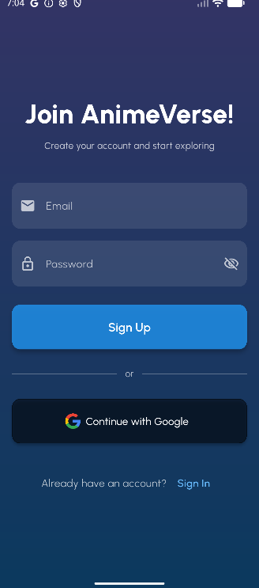

# 🌸 AnimeVerse  
Aplikasi pencarian anime dengan fitur lengkap mulai dari eksplorasi anime, detail informasi, hingga manajemen favorit yang dibangun menggunakan Flutter, Firebase, dan Jikan API.

---

## 👩‍🎓 Identitas Mahasiswa

| Informasi | Detail |
|----------|--------|
| **Nama** | Alissya Humairah Martiasaputri |
| **NIM**  | 231401039 |
| **KOM**  | C |


---

## 📌 Deskripsi Project  
**AnimeVerse** adalah aplikasi mobile untuk mencari dan melihat informasi berbagai anime. Aplikasi ini memanfaatkan *Jikan API* (MyAnimeList unofficial API) sebagai sumber data dan Firebase untuk autentikasi serta penyimpanan data favorit.

### ✨ Fitur Utama  
- **Eksplorasi Anime**  
  Menelusuri berbagai anime populer & trending dari Jikan API.  
- **Detail Anime Lengkap**  
  Menampilkan judul, genre, deskripsi, rating, dan informasi lainnya.
  - **Favorit Anime**  
  Menyimpan, menambah, dan menghapus anime favorit secara real-time dengan Cloud Firestore.
- **Profil Pengguna**  
  Menampilkan dan mengelola informasi dasar pengguna yang login.
- **Autentikasi Pengguna**  
  Login menggunakan Google Sign-In atau email melalui Firebase Authentication.  

---

## 📸 Screenshots

| 🏠 Home Screen | 🔍 Detail Screen | ❤️ Favorite Screen |
|--------|-----------|-------------|
|  |  |  |

| 👤 Profile Screen | 🔑 Sign In Screen | 📝 Sign Up Screen |
|------------|------------|-------------|
|  |  |  |


---

## 🎥 Demo Aplikasi  
**Demo:** [disini](https://youtu.be/UmQ88ZD9oLw)

---

## 📁 Struktur Proyek  

```text
lib/
├── main.dart                               # Entry point aplikasi Flutter
├── config/
│   └── routes.dart                         # Konfigurasi rute & navigasi aplikasi
├── models/
│   └── anime.dart                          # Model untuk Anime
├── provider/
│   ├── app_state_provider.dart              # State global aplikasi
│   └── auth_provider.dart                   # Provider untuk autentikasi user
├── repositories/
│   └── anime_repository.dart                # Logika pengambilan & pengelolaan data Anime
├── screens/
│   ├── home_screen.dart                     # Halaman utama aplikasi
│   ├── detail_screen.dart                   # Halaman detail anime
│   ├── favorite_screen.dart                 # Halaman daftar anime favorit user
│   ├── profile_screen.dart                  # Halaman profil user
│   ├── signin_screen.dart                   # Halaman login
│   └── signup_screen.dart                   # Halaman registrasi
├── services/
│   ├── firestore_service.dart               # Service untuk komunikasi dengan Firestore
│   └── auth/
│       └── auth_service.dart                # Service untuk login/daftar/logout Firebase Auth
├── utils/
│   ├── snackbar_helper.dart                 # Helper untuk menampilkan snackbar
│   └── validators.dart                      # Validasi form 
└── widgets/
    ├── anime_card.dart                      # Widget kartu anime 
    ├── anime_view.dart                      # Widget tampilan detail anime
    ├── app_scaffold.dart                    # Scaffold custom dengan struktur layout app
    ├── bottom_navigation_shell.dart         # Bottom navigation bar utama
    ├── favorite_anime_card.dart             # Kartu khusus untuk item favorit
    ├── genre_list.dart                      # Widget daftar genre anime
    ├── gradient_background.dart              # Background gradasi reusable
    └── profile_button.dart                  # Tombol profil (avatar + menu)
```


---

## 🔌 APIs & Services
### **Jikan API – MyAnimeList Unofficial API**  
Digunakan untuk mengambil data anime seperti judul, genre, rating, dan detail lainnya.  
Dokumentasi: https://docs.api.jikan.moe/

### **Services**
- Firebase Authentication  
- Cloud Firestore  
- Flutter Framework

---

## 📦 Packages & Dependencies

| Package                   | Versi     | Fungsi |
|--------------------------|-----------|--------|
| cupertino_icons          | ^1.0.8    | Icon gaya iOS |
| flutter_svg              | ^2.2.3    | Menampilkan SVG |
| go_router                | ^17.0.0   | Routing aplikasi |
| shared_preferences       | ^2.5.3    | Local storage ringan |
| provider                 | ^6.1.5+1  | State management |
| http                     | ^1.6.0    | HTTP client |
| cached_network_image     | ^3.4.1    | Cache gambar |
| firebase_core            | ^4.2.1    | Core Firebase SDK |
| firebase_auth            | ^6.1.2    | Autentikasi pengguna |
| google_sign_in           | ^7.2.0    | Login Google |
| cloud_firestore          | ^6.1.0    | Database Firebase |
| flutter_launcher_icons   | ^0.14.4   | Generate app icon |
| flutter_native_splash    | ^2.4.7    | Generate splash screen |


---

## 📥 Cara Instalasi Aplikasi  

1. Buka halaman **Releases** pada repository ini.  
2. Pilih rilis terbaru  
3. Scroll ke bagian **Assets** dan unduh file **app-release.apk**.  
4. Setelah selesai diunduh, buka file APK tersebut di perangkat Android kamu.  
5. Izinkan instalasi dari sumber luar (jika diminta), lalu lanjutkan proses pemasangan.  
6. Aplikasi siap digunakan! 🎉

---

## ⭐ Terima Kasih!  

